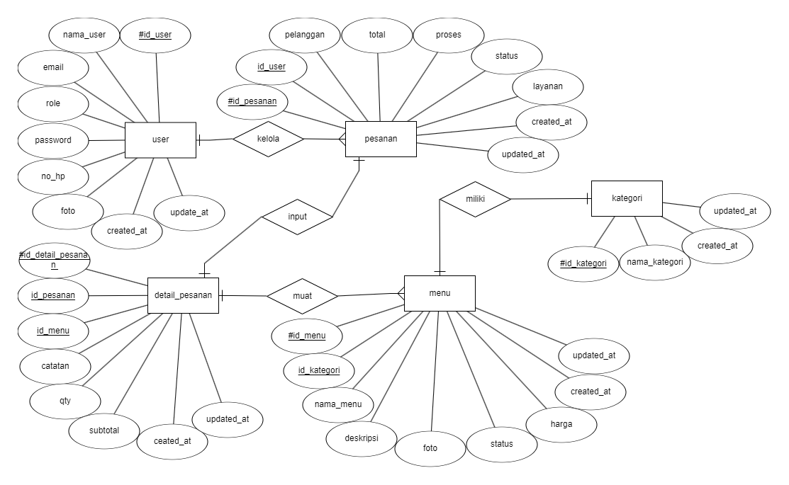
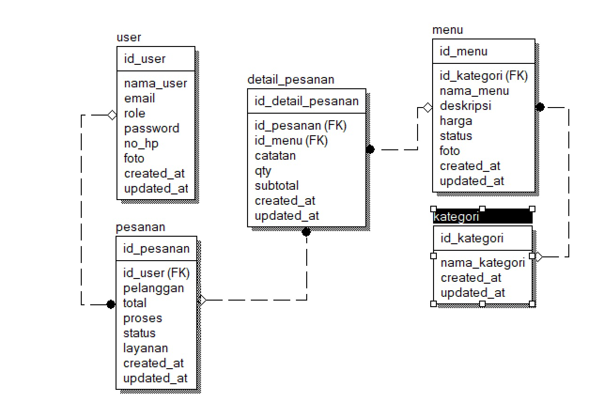

# Coffee Shop

<p align="center"></p>


## Pengenalan Project

Lorem ipsum dolor sit amet consectetur adipisicing elit. Consectetur, quasi! Sint aspernatur culpa, cupiditate vitae expedita sit impedit esse rem fugiat, modi est, eveniet iusto molestias qui deleniti voluptatum quos!

## Nama Kelompok
<table border="1">
  <thead>
    <tr>
      <td>No</td>
      <td>NIM</td>
      <td>Nama Anggota</td>
    </tr>
  <thead>
  <tbody>
    <tr>
      <td>1</td>
      <td>19230339</td>
      <td>Arman Jaya Laia</td>
    </tr>
    <tr>
      <td>2</td>
      <td>19231904</td>
      <td>Arnanda Surya Mukti</td>
    </tr>
    <tr>
      <td>3</td>
      <td>19231669</td>
      <td>Raihan Muhammad Ikhsan Swarga</td>
    </tr>
    <tr>
      <td>4</td>
      <td>19231320</td>
      <td>Vivi Oktaviyanti</td>
    </tr>
    <tr>
      <td>5</td>
      <td>19230468</td>
      <td>Willy Andryan</td>
    </tr>
  </tbody>
</table>

## ERD & LRS
<p align="center"></p>
<p align="center"></p>

## Skenario Kebutuhan Pengguna
<strong>Pelanggan</strong>
<ol>
<li>Dapat Melihat Menu.</li>
</ol>

<strong>Admin</strong>
<ol>
<li>Dapat Melakukan Login.</li>
<li>Dapat Melakukan Manajemen Pengguna (Menambah/Mengedit/Menghapus Pengguna).</li>
<li>Dapat Melakukan Manajemen Kategori (Menambah/Mengedit/Menghapus Kategori).</li>
<li>Dapat Melakukan Manajemen Menu (Menambah/Mengedit/Menghapus Menu).</li>
<li>Dapat Melihat Data Pesanan Pelanggan.</li>
<li>Dapat Melakukan Tambah/Edit/Menghapus Pesanan.</li>
<li>Dapat Memproses Pesanan Pelanggan.</li>
<li>Dapat Mencetak Laporan Detail Pesanan.</li>
<li>Dapat Mencetak Laporan Transaksi.</li>
</ol>

<strong>Kasir</strong>
<ol>
<li>Dapat Melakukan Login.</li>
<li>Dapat Melihat Data Pesanan Pelanggan.</li>
<li>Dapat Melakukan Tambah/Edit/Menghapus Pesanan.</li>
<li>Dapat Mencetak Laporan Detail Pesanan.</li>
<li>Dapat Mencetak Laporan Transaksi.</li>
</ol>

<strong>Barista</strong>
<ol>
<li>Dapat Melakukan Login.</li>
<li>Dapat Melihat Detail Pesanan Pelanggan.</li>
<li>Dapat Memproses Pesanan Pelanggan.</li>
</ol>
<!-- Sesuaikan dengan hak akses dari project masing-masing kelompok -->

## Pra-Install
Sebelumnya pastikan menginstall terlebih dahulu kebutuhan sistem untuk menggunakan project ini.
- [x] Git
- [x] Composer
- [x] Code Editor <code>VS Code, Sublime Text atau sejenisnya</code>
- [x] Web Server <code>Laragon, Xampp atau sejenisnya</code>
- [x] Web Browser <code>Chrome, Mozilla atau sejenisnya</code>
- [x] Node.js <code>(opsional)</code>

## Cara Install
1. Cloning repository ini melalui terminal. Tunggu hingga selesai cloning.
```
git clone https://github.com/Adryn27/CoffeeShop.git
```
<!-- Ubah link diatas dengan link repository yang kalian -->

2.  Buka project menggunakan Code Editor, lalu inisiasi dependensi composer melalui terminal.
```
composer install
```
3. Duplikat file `.env.example` menjadi `.env` dan konfigurasikan koneksi database menjadi seperti ini pada file `.env`
```
DB_CONNECTION=mysql
DB_HOST=127.0.0.1
DB_PORT=3306
DB_DATABASE=db_coffeeshop
DB_USERNAME=root
DB_PASSWORD=
```
<!-- Ubah nama DB sesuai nama DB projectnya -->

4. Generate key aplikasi pada env melalui terminal.
```
php artisan key:generate
```
5. Generate Storage Link melalui terminal agar dapat mengakses storage.
```
php artisan storage:link
```
6. Migrasikan tabel beserta seeder melalui terminal.
```
php artisan migrate:fresh --seed
```

## Screenshot
<table width="100%">
<tr>
<td><h3 align="center">Halaman Menu Pelanggan</h3></td>
<td><h3 align="center">Halaman Detail Menu Pelanggan</h3></td>
</tr>
<tr>
<td><h3 align="center">Halaman Login</h3></td>
<td><h3 align="center">Halaman Beranda</h3></td>
</tr>
<tr>
<td><h3 align="center">Halaman Profile Pengguna</h3></td>
<td><h3 align="center">Halaman Daftar Pengguna</h3></td>
</tr>
<tr>
<td><h3 align="center">Halaman Tambah Pengguna</h3></td>
<td><h3 align="center">Halaman Edit Pengguna</h3></td>
</tr>
<tr>
<td><h3 align="center">Halaman Daftar Kategori</h3></td>
<td><h3 align="center">Halaman Tambah Kategori</h3></td>
</tr>
<tr>
<td><h3 align="center">Halaman Edit Kategori</h3></td>
<td><h3 align="center">Halaman Daftar Menu</h3></td>
</tr>
<tr>
<td><h3 align="center">Halaman Tambah Menu</h3></td>
<td><h3 align="center">Halaman Edit Menu</h3></td>
</tr>
<tr>
<td><h3 align="center">Halaman Daftar Pesanan</h3></td>
<td><h3 align="center">Halaman Tambah/Edit Pesanan</h3></td>
</tr>
<tr>
<td><h3 align="center">Lanjutan Halaman Tambah/Edit Pesanan</h3></td>
<td><h3 align="center">Halaman Daftar Proses Pesanan</h3></td>
</tr>
<tr>
<td><h3 align="center">Halaman Proses Pesanan Pelanggan</h3></td>
<td><h3 align="center">Halaman Laporan Detail Pesanan</h3></td>
</tr>
<tr>
<td><h3 align="center">Modal Cetak Laporan Detail Pesanan</h3></td>
<td><h3 align="center">Hasil Cetak Laporan Detail Pesanan</h3></td>
</tr>
<tr>
<td><h3 align="center">Halaman Laporan Transaksi</h3></td>
<td><h3 align="center">Modal Cetak Laporan Transaksi</h3></td>
</tr>
<tr>
<td><h3 align="center">Hasil Cetak Laporan Transaksi</h3></td>
<td><h3 align="center">Hasil Cetak Struk Pesanan</h3></td>
</tr>
</table>

## Lisensi

Project ini dibuat untuk menyelesaikan project mata kuliah Web Programming II Universitas Bina Sarana Informatika (UBSI) yang diampu oleh Bpk. <a href="https://github.com/yuris60">Yuris Alkhalifi, M.Kom., CPDSA</a> selaku Dosen. Project ini bersifat open source untuk edukasi.
<!-- Kalian boleh mengubah bentuk lisensi ini sesuai kesepakatan kelompok apakah akan bersifat open source atau tidak -->
<blockquote>Kuliah...? BSI AJA !!</blockquote>